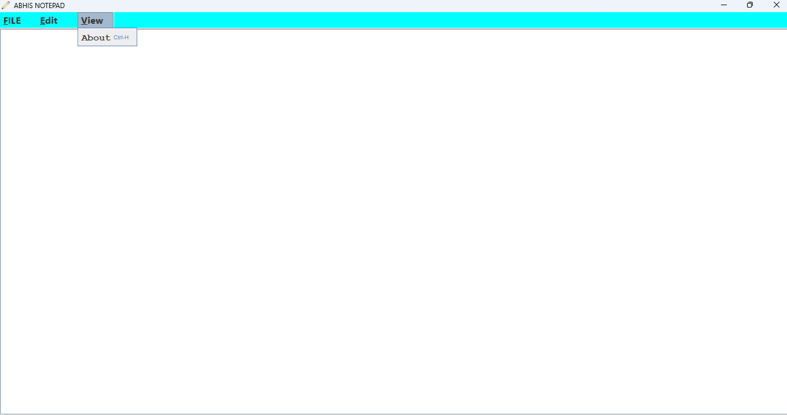
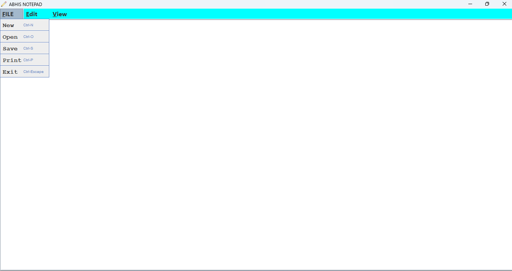
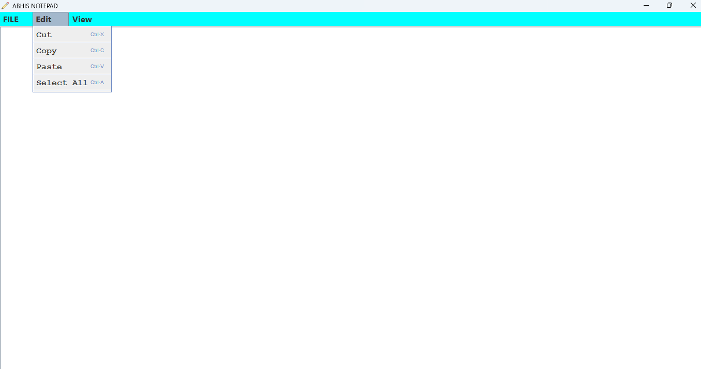
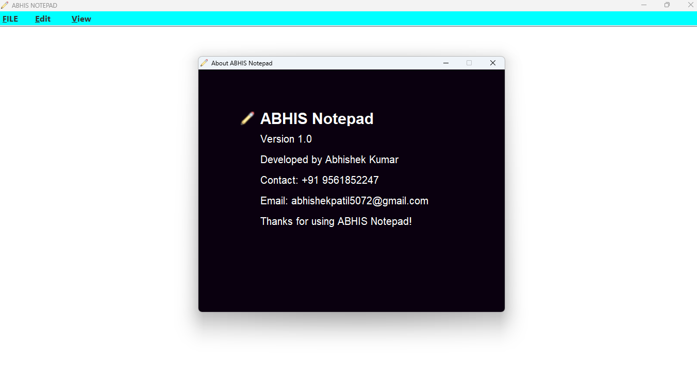

<div align="center">

# 📝 Notepad Clone

### A fully functional Windows Notepad replica built with Java Swing


<br/>

> A clean, lightweight desktop text editor that mimics the core functionality of **Windows Notepad** —  
> built entirely in Java using the Swing GUI toolkit. No dependencies. Just Java.

<br/>

---

</div>

## 📸 Screenshots

<div align="center">

### 🖥️ Main Editor Window


### 📂 File Operations


### ✂️ Edit Menu


### ℹ️ About Dialog


</div>

> 📌 **Tip:** Rename your screenshot files inside the `screenshots/` folder to match the filenames above,  
> or update the paths in this README to match your actual filenames.

---

## 📋 Table of Contents

- [About the Project](#-about-the-project)
- [Features](#-features)
- [Tech Stack](#-tech-stack)
- [Project Structure](#-project-structure)
- [Getting Started](#-getting-started)
- [How to Run](#-how-to-run)
- [Architecture](#-architecture)
- [Author](#-author)

---

## 🧠 About the Project

**Notepad Clone** is a desktop text editor application developed in **Java** using the **Swing** GUI framework. It faithfully replicates the classic Windows Notepad experience — simple, fast, and distraction-free.

This project demonstrates the use of Java's built-in GUI libraries to build a real-world desktop application complete with file I/O, menu systems, dialog boxes, and clipboard operations — **all with zero external dependencies**.

---

## ✨ Features

| Feature | Description |
|---|---|
| 📄 New File | Create a fresh blank document instantly |
| 📂 Open File | Browse and open any `.txt` file from your system |
| 💾 Save File | Save the current document to disk |
| 🖨️ Print | Send the text content directly to a printer |
| ✂️ Cut | Cut selected text to clipboard |
| 📋 Copy | Copy selected text to clipboard |
| 📌 Paste | Paste text from clipboard into editor |
| 🔲 Select All | Select entire editor content in one click |
| ℹ️ About Dialog | Displays application info in a clean popup |
| 🚪 Exit | Gracefully close the application |

---

## 🛠️ Tech Stack

```
Language     : Java (JDK 8+)
GUI Toolkit  : Java Swing
Architecture : Monolithic — Event-Driven
Complexity   : Simple
Executable   : abhisNotepad.exe (Windows)
```

---

## 📁 Project Structure

```
Notepad_Clone/
│
├── 📄 Notepad.java           # Main class — builds and launches the app window
├── 📄 About.java             # About dialog window logic
├── 📄 Notepad.class          # Compiled bytecode
├── 📄 About.class            # Compiled bytecode
├── 🖥️  abhisNotepad.exe      # Standalone Windows executable
│
├── 📂 images/                # Icons or image assets used in the UI
│
├── 📂 screenshots/           # App screenshots (used in this README)
│   ├── main_window.png
│   ├── file_operations.png
│   ├── edit_menu.png
│   └── about_dialog.png
│
└── 📄 README.md
```

---

## 🚀 Getting Started

### Prerequisites

Make sure **Java JDK 8 or above** is installed on your machine.

```bash
# Verify Java installation
java -version
```

> If not installed → Download from: https://www.oracle.com/java/technologies/downloads/

---

## ▶️ How to Run

### 🟢 Option 1 — Run the `.exe` directly *(Windows only)*

```
Simply double-click  →  abhisNotepad.exe
```

---

### 🟡 Option 2 — Run from Source Code

```bash
# Step 1: Clone the repository
git clone https://github.com/abhishek-2247/Notepad_Clone.git

# Step 2: Navigate into the folder
cd Notepad_Clone

# Step 3: Compile the source files
javac Notepad.java About.java

# Step 4: Launch the application
java Notepad
```

---

### 🔵 Option 3 — Run Pre-compiled `.class` Files

```bash
# If .class files are already present, just run:
java Notepad
```

---

## 🏗️ Architecture

```
┌──────────────────────────────────────────┐
│               Notepad.java               │
│                                          │
│   ┌──────────────────────────────────┐   │
│   │          JFrame (Window)         │   │
│   │                                  │   │
│   │   ┌──────────────────────────┐   │   │
│   │   │        JMenuBar          │   │   │
│   │   │   File | Edit | Help     │   │   │
│   │   └──────────────────────────┘   │   │
│   │                                  │   │
│   │   ┌──────────────────────────┐   │   │
│   │   │       JTextArea          │   │   │
│   │   │   (Main Editor Area)     │   │   │
│   │   └──────────────────────────┘   │   │
│   └──────────────────────────────────┘   │
│                                          │
│               About.java                 │
│   ┌──────────────────────────────────┐   │
│   │      JDialog (About Popup)       │   │
│   └──────────────────────────────────┘   │
└──────────────────────────────────────────┘

Pattern : Event-Driven (ActionListener on each menu item)
File I/O: FileReader / FileWriter / BufferedReader
```

> **Architecture:** Monolithic — all core logic lives within a few tightly coupled classes,  
> following the event-driven pattern standard in Java Swing applications.

---

## 👨‍💻 Author

**Patil Abhishek Vitthal**  
🔗 GitHub: [@abhishek-2247](https://github.com/abhishek-2247)

---

<div align="center">

⭐ **If you found this useful, drop a star on the repo — it means a lot!**

<br/>

*Built with ☕ Java and a love for clean, minimal desktop software.*

</div>
